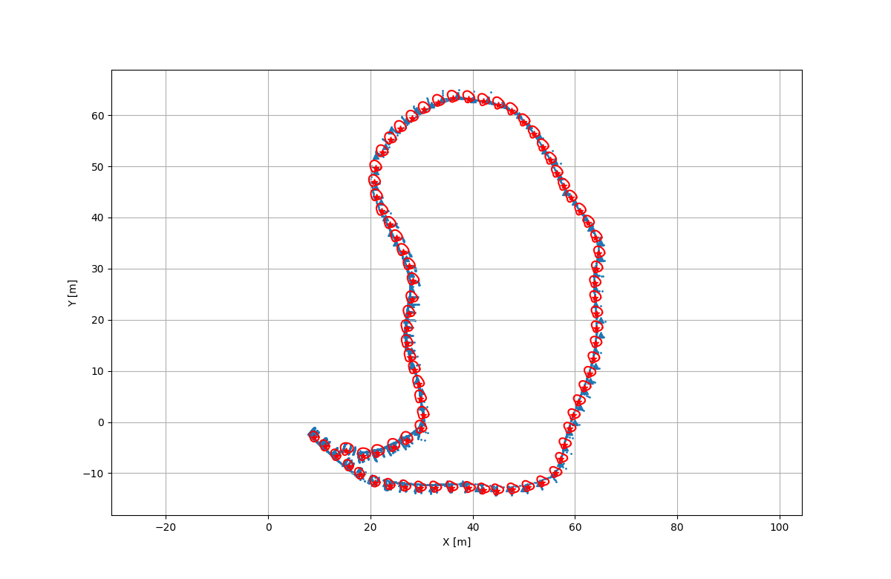
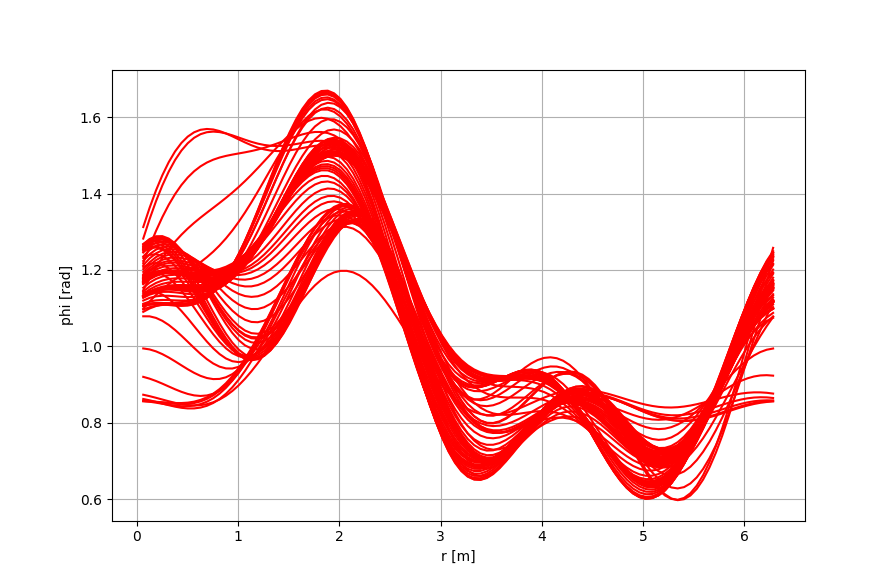

# rhm
Random Hypersurface Model

Based on articles:
* "Shape tracking of extended objects and group targets with star-convex RHMs"; Marcus Baum and Uwe D. Hanebeck
* "Tracking of Maneuvering Star-Convex Extended Target Using Modified Adaptive Extended Kalman Filter"; Tinali Ma, Qi Zhang Chaobo Chen, and Song Gao

## Results

